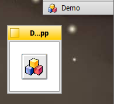

# DrawButton
This is a demo program that showcases a function for drawing an empty BButton into a view. This might be useful when want to create a BPictureButton that shall look BeOS-like.

```
void DrawButton(	BView *view, BRect frame = BRect(0,0,0,0), bool pressed = false)
```



The Button is drawn into `view`. If given, it uses the dimensions of `frame`, otherwise it uses the views dimensions. `pressed` describes the look: normal button or pressed button.s

This source code is Public Domain. You can use it at your own risk.

Author: Werner Freytag (freytag at gmx dot de) http://www.pecora.de/